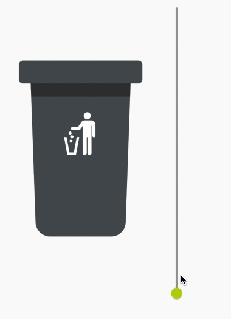

   

# Flutter Image Progression

This package allows you to overlay multiple images on top of eachother and show partial images based on a progression value. Complex effects can be achieved by using multiple images and setting the progression value to a value between 0 and 1. This is for instance useful for showing a progress bar or a loading animation.

Supports all Flutter platforms.

## Usage

To use this package, add `flutter_image_progression` as a [dependency in your pubspec.yaml file](https://flutter.dev/docs/development/platform-integration/platform-channels).

## How to use

See the [Example Code](example/lib/main.dart) for an example on how to use this package.

## Issues

Please file any issues, bugs or feature request as an issue on our [GitHub](https://github.com/Iconica-Development/flutter_image_progression) page. Commercial support is available if you need help with integration with your app or services. You can contact us at [support@iconica.nl](mailto:support@iconica.nl).

## Want to contribute

If you would like to contribute to the plugin (e.g. by improving the documentation, solving a bug or adding a cool new feature), please carefully review our [contribution guide](./CONTRIBUTING.md) and send us your [pull request](https://github.com/Iconica-Development/flutter_image_progression/pulls).

## Author

This flutter_image_progression for Flutter is developed by [Iconica](https://iconica.nl). You can contact us at <support@iconica.nl>
